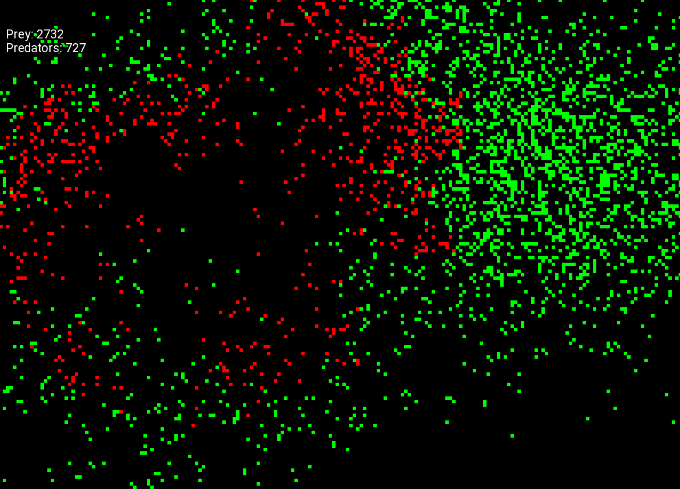

# Predator And Prey
A Cellular Automata project demonstrating two different types of automata that balance each other out. One is Prey that reproduces and the other is a Predator that consumes the Prey to reproduce. Written in C++ with SFML.

  

## Requirements
- [SFML](https://www.sfml-dev.org/index.php)
